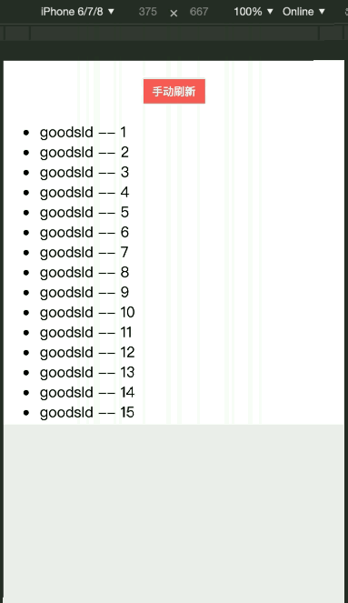

# vpull-refresh
基于vue封装的轻量级下拉刷新组件

#### 如何使用
将项目中的`src/components/pullRefresh.vue`和`src/img`拷贝到你的工程内。如层级发生改变，你需要手动修改`pullRefresh.vue`中的图片链接地址。
#### API
属性 | 说明 | 类型 | 默认值
----|-----|------|------
refreshing | 是否处于刷新状态| boolean | `false`
onRefresh | 刷新的回调函数 | function | `() => {}`
tipHeight | 刷新提示信息的高度 | string | `50px`
pullHeight| 滚动区域高度 | string | `100vh`
pullTip | 下拉时的提示文字 | string | `下拉即可刷新`
refreshTip | 刷新中的提示文字 | string | `正在刷新`

#### 示例

```
<template>
<pull-refresh :refreshing="isRefreshing" :on-refresh="onRefresh" pull-height="400px">
  <div class="list">
    <p v-for="n in 20">{{n}}</p>
  </div>
</pull-refresh>
</template>

<script>
import pullRefresh from "@/components/pullRefresh.vue";
  export default  {
    name: 'Example',
    data() {
      return {
        isRefreshing: false
      }
    },
    methods: {
      onRefresh() {
        //刷新前需要先手动将设为true，否则pull-refresh不会监测到状态变化
        this.isRefreshing = true;
        setTimeout(() => {
          this.isRefreshing = false;
        }, 2000)
      }
    },
    components: { pullRefresh }
}
</script>

<style scoped>
.list {
  background-color: white;
}
p {
  margin: 0;
}
</style>
```



#### 手动刷新
```
<pull-refresh :refreshing="isRefreshing">
  <div class="list">
    <button @click="onRefresh">手动刷新</button>
    <p v-for="n in 20">{{n}}</p>
  </div>
</pull-refresh>
```
